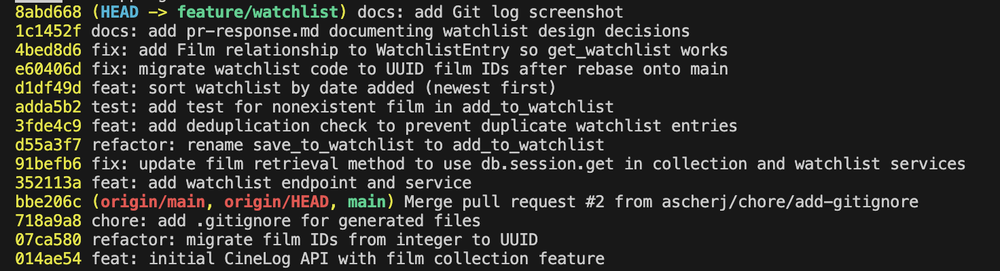

# PR Response Doc — CineLog Watchlist Feature

## AI Usage
**Comment 5 (devil's advocate):** Asked AI to attack my date-added draft. It flagged two gaps — newest-first buries long-standing intent, and I was dismissing alphabetical's findability. Both were real, so I named those costs explicitly and justified newest-first deliberately. Core argument was my own.

## Comment 1 — Rename
**What I did:** I renamed all instances of save_to_watchlist() into add_to_watchlist()
**Where I looked:** Ran a repo-wide grep for both save_to_watchlist and add_to_watchlist across all .py files. Call sites were the definition in services/watchlist_service.py, the import + call in routes/watchlist/watchlist.py, and the import + usage in tests/test_watchlist.py.
**How I verified:** I global searched for all instanced of save_to_watchlist() to ensure none remained.

## Comment 2 — Deduplication
**What I did:** Added deduplication logic into add_to_watchlist() using a similar formatting from add_to_collection()
**How I verified:** Ran the app live. first add returned 201, duplicate returned 409, and the DB held only one row.

## Comment 3 — Missing test
**What I did:** Added tests/test_watchlist.py with a test that adding a nonexistent film_id raises FilmNotFoundError.
**Test I used as a model:** tests/test_collection.py — its docstring points you there as the pattern for the codebase. I mirrored its app and sample_user fixtures (in-memory SQLite, create_all/drop_all teardown) and its pytest.raises structure.
**How I verified:** Ran pytest tests/test_watchlist.py -v — 1 passed.

## Comment 4 — Default visibility
**My position:** Keeping `public=True`. CineLog is a social film app, so adding to a watchlist is an implicitly social act — the same reason Letterboxd defaults watchlists to public.
**Reasoning:** I'm optimizing for the common case. Users add films they're excited to share, and public-by-default is what feeds discovery and the follow graph. Defaults are sticky, so a private default would leave sharing as a feature almost nobody opts into.
**Tradeoff acknowledged:** The cost is the less privacy-conservative default. A user who'd rather keep an entry private is exposed until they notice the flag. I accept that here because the data is low-sensitivity (films you want to watch), but only if `public` is editable at add-time; for anything more sensitive I'd flip to private-by-default.

## Comment 5 — Sort order
**My position:** Agreed — switched `get_watchlist()` from alphabetical to `WatchlistEntry.date_added.desc()` (newest first), matching `get_collection()`.

**Reasoning:** A watchlist isn't a reference table you look titles up in — it's a record of intent captured over time. On CineLog that intent is discovery-driven: users add films reacting to the feed. Date-added preserves that story; alphabetical erases it and floats "Amélie" above a film you added tonight and actually want to watch.

**Engagement with reviewer's point:** The reviewer's reason is consistency with `get_collection()`. I'd flag that consistency alone doesn't carry it — collection is a *watched* log, watchlist is a *to-watch* backlog, so "match the other list" is a false friend; the watchlist reasoning above is what actually settles it. It also doesn't decide *direction*, and there I'm accepting two real costs of newest-first: it buries long-standing intent, and it loses alphabetical's findability ("did I already add this?"). I still chose it because on CineLog top-of-list tracks current excitement. If those costs bite, the clean fix is a `?sort=` param defaulting to date-desc — flagging it as the next step, not shipping it here.

## Comment 6 — Rebase
**What conflicted:** A trivial `.gitignore` add/add (took the union). The real issue was silent: `main`'s migration deleted the `WatchlistEntry` model, and since no commit of mine touched `models.py`, git kept the deletion without flagging a conflict — dropping the model my feature needs.
**How I resolved it:** Kept main's UUID versions of `Film` and `CollectionEntry`, and re-added `WatchlistEntry` with `film_id` as a `String(36)` UUID instead of `Integer`, plus fixed the leftover integer references in the watchlist docstrings.
**How I verified no conflict remains:** `git log --merges origin/main..HEAD` is empty (linear history, no merge commits), all 5 tests pass, and I ran the add/dedup/not-found/view flow end-to-end with real UUIDs.

## Git Log


## PR description

Adds a **watchlist** — a per-user list of films saved to watch later, kept separate from the existing *collection* (films already watched). It ships a `WatchlistEntry` model and two endpoints:

| Method | Endpoint | Purpose |
|--------|----------|---------|
| `POST` | `/watchlist/<user_id>/add` | Add a film to a user's watchlist. Body: `{ "film_id": "<uuid>" }` |
| `GET`  | `/watchlist/<user_id>` | Return the user's watchlist, newest first |

Behavior:
- **Add** returns `201` with the new entry. Adding a nonexistent `film_id` returns `404` (`FilmNotFoundError`); a missing `film_id` in the body returns `400`.
- **Deduplication** — adding a film already on the user's watchlist returns `409` (`AlreadyInWatchlistError`) instead of creating a second row.
- **View** returns each film's data plus its `date_added` and `public` flag.

### Design decisions

**1. Visibility default — `public=True`.** New watchlist entries are public by default. CineLog is a social film app, so saving a film is an implicitly social act (the same reason Letterboxd defaults watchlists to public), and public-by-default is what feeds discovery and the follow graph. The tradeoff is a less privacy-conservative default: an entry is visible until the user flips the flag. I accept that here because the data is low-sensitivity (films you *want* to watch) and only because `public` is editable at add-time — for anything more sensitive I'd flip to private-by-default.

**2. Sort order — newest first (`date_added.desc()`).** `get_watchlist()` orders by date added, descending. A watchlist is a record of intent captured over time, not a reference table you look titles up in — and on CineLog that intent is discovery-driven (users add films reacting to the feed). Date-added preserves that story; alphabetical would float "Amélie" above a film you added tonight and actually want to watch. Accepted costs of newest-first: it buries long-standing intent, and it loses alphabetical's findability ("did I already add this?"). If those bite, the clean next step is a `?sort=` query param defaulting to date-desc — flagged, not shipped here.

### How to test manually

The app has no film/user creation endpoint and starts with an empty DB, so seed one user and two films first.

1. **Start the app** (creates `cinelog.db`):
   ```bash
   pip install -r requirements.txt
   python app.py     # runs on http://localhost:5000
   ```

2. **Seed a user and two films** — in a second terminal:
   ```bash
   python3 -c "
   from app import create_app, db
   from models import User, Film
   app = create_app()
   with app.app_context():
       u = User(username='ada', email='ada@example.com')
       f1 = Film(title='Whiplash', year=2014)
       f2 = Film(title='Amélie', year=2001)
       db.session.add_all([u, f1, f2]); db.session.commit()
       print('USER_ID =', u.id)
       print('FILM1_ID =', f1.id)
       print('FILM2_ID =', f2.id)
   "
   ```
   Copy the three IDs it prints.

3. **Add a film** → expect `201` and a JSON entry with `"public": true`:
   ```bash
   curl -i -X POST http://localhost:5000/watchlist/<USER_ID>/add \
     -H "Content-Type: application/json" -d '{"film_id": "<FILM1_ID>"}'
   ```

4. **Deduplication** — run the exact same command again → expect `409` (`already in this user's watchlist`).

5. **Nonexistent film** → expect `404`:
   ```bash
   curl -i -X POST http://localhost:5000/watchlist/<USER_ID>/add \
     -H "Content-Type: application/json" -d '{"film_id": "does-not-exist"}'
   ```

6. **Missing field** → expect `400`:
   ```bash
   curl -i -X POST http://localhost:5000/watchlist/<USER_ID>/add \
     -H "Content-Type: application/json" -d '{}'
   ```

7. **Sort order** — add the second film, then view the list:
   ```bash
   curl -s -X POST http://localhost:5000/watchlist/<USER_ID>/add \
     -H "Content-Type: application/json" -d '{"film_id": "<FILM2_ID>"}'
   curl -s http://localhost:5000/watchlist/<USER_ID>
   ```
   Expect **Amélie first** (added most recently), then Whiplash — confirming newest-first.

8. **Automated tests**:
   ```bash
   pytest tests/test_watchlist.py -v   # 1 passed
   ```
